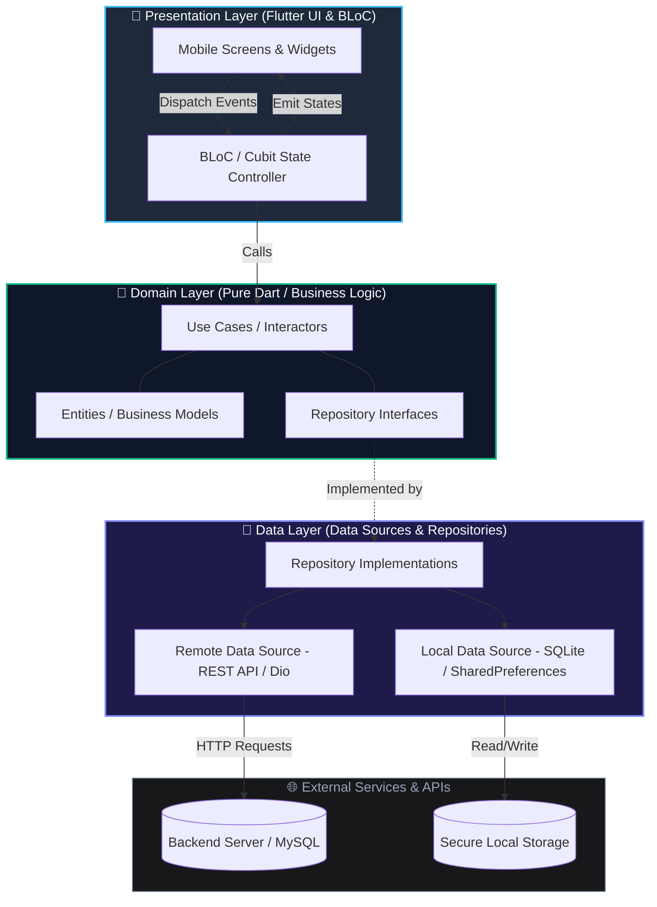

# 📱 Theeraphat Srimontha — Mobile Developer Portfolio

<div align="center">

  <!-- Status & Deploy Badges -->
  <a href="https://theeraphat-portfolio.vercel.app/">
    
  </a>
  <a href="https://github.com/Theeraphat-S/Portfolio-Web">
    
  </a>
  <a href="mailto:theeraphat.sm@gmail.com">
    
  </a>

  <br />
  <br />

  <!-- Core Stacks Badges -->
  <a href="https://flutter.dev/">
    
  </a>
  <a href="https://dart.dev/">
    
  </a>
  <a href="https://react.dev/">
    
  </a>
  <a href="https://www.typescriptlang.org/">
    
  </a>
  <a href="https://tailwindcss.com/">
    
  </a>
  <a href="https://vitejs.dev/">
    
  </a>

  <br />
  <br />

  <p align="center">
    <strong>🌟 High-Performance, Interactive & Bilingual Web Portfolio</strong><br>
    Showcasing Mobile Application Development expertise in <b>Flutter, Dart, Clean Architecture, and BLoC State Management</b>.<br>
    <i>เว็บพอร์ตโฟลิโอส่วนตัวระดับมืออาชีพ นำเสนอผลงาน ประสบการณ์ และสถาปัตยกรรมโมบายแอปพลิเคชัน</i>
  </p>

  <p align="center">
    <a href="https://theeraphat-portfolio.vercel.app/"><strong>🌐 Launch Live Demo »</strong></a>
    &nbsp;•&nbsp;
    <a href="#-executive-summary--key-highlights">Executive Summary</a>
    &nbsp;•&nbsp;
    <a href="#-mobile-engineering--clean-architecture">Architecture</a>
    &nbsp;•&nbsp;
    <a href="#-featured-projects--metrics">Projects</a>
    &nbsp;•&nbsp;
    <a href="#-technical-skills--competencies">Skills</a>
    &nbsp;•&nbsp;
    <a href="#-getting-started--local-development">Setup Guide</a>
    &nbsp;•&nbsp;
    <a href="#-developer-profile--contact">Contact</a>
  </p>

</div>

---

> [!TIP]
>
> ### ⚡ **Instant Live Production Website**
>
> 🔗 **Direct URL:** [**https://theeraphat-portfolio.vercel.app/**](https://theeraphat-portfolio.vercel.app/)  
> Experience real-time bilingual switching (TH/EN), 60 FPS Lenis smooth scrolling, interactive phone simulator, and fluid micro-animations.

---

## 🌟 Executive Summary & Key Highlights

### 🇺🇸 English

This repository hosts the modern web portfolio of **Theeraphat Srimontha (Oven)** — a **Mobile Application Developer** specialized in **Flutter, Dart, BLoC State Management, and Clean Architecture**. The site is crafted with modern web engineering standards, zero-lag animations, and interactive simulators to provide recruiters and engineering leads with a tangible preview of mobile apps and engineering practices.

### 🇹🇭 ภาษาไทย

เว็บพอร์ตโฟลิโอส่วนตัวระดับพรีเมียมของ **นายธีรภัทร ศรีมณฑา (โอเว่น / Oven)** — **Mobile Application Developer** ผู้เชี่ยวชาญด้าน **Flutter & Dart, BLoC Architecture, Clean Architecture** และการเชื่อมต่อระบบ **REST API** ความเสถียรสูง พัฒนาขึ้นเพื่อนำเสนอผลงานระดับโปรดักชัน ทักษะทางเทคนิค และประสบการณ์วิชาการแก่องค์กรและผู้ว่าจ้าง

### 🎯 Key Interactive Features / ไฮไลต์เด่นของระบบ

| Feature / ฟีเจอร์                   | Technical Description (EN)                                                                 | คำอธิบายและจุดเด่น (TH)                                                            |
| :---------------------------------- | :----------------------------------------------------------------------------------------- | :--------------------------------------------------------------------------------- |
| 📱 **Interactive Mobile Simulator** | Dynamic smartphone frame with switchable preview screens and interactive flows             | จำลองการใช้งานแอปพลิเคชันบนหน้าจอมือถือจริง พร้อมปุ่มสลับหน้าจอพรีวิวแบบ Real-time |
| 🌐 **Real-time Bilingual Engine**   | Single-source-of-truth bilingual architecture (`portfolioData.ts`) with zero hydration lag | สลับภาษาไทย-อังกฤษได้ทันทีทั่วทั้งหน้าเว็บ โดยไม่มีการรีโหลดหน้า                   |
| ⚡ **60 FPS Lenis Smooth Scroll**   | Inertia-based momentum scrolling integrated with React 19 lifecycle                        | การเลื่อนหน้าจอที่นุ่มนวลระดับ 60 FPS ด้วย Lenis Scroll Engine                     |
| 🍱 **Responsive Bento Grid**        | Glassmorphism dark-mode cards with spotlight and tilt effects                              | การจัดวางประวัติ การศึกษา และสถิติในรูปแบบ Bento Grid สไตล์พรีเมียม                |
| 📂 **Deep-dive Project Modals**     | Architectural breakdown, feature lists, impact metrics, and repo links                     | หน้าต่างเจาะลึกรายละเอียดโปรเจกต์ สถาปัตยกรรม ซอร์สโค้ด และผลลัพธ์เชิงตัวเลข       |
| 📬 **Instant Contact & Confetti**   | Clipboard API integration with festive canvas confetti feedback                            | ปุ่มคัดลอกอีเมลลง Clipboard ในคลิกเดียว พร้อมเอฟเฟกต์พลุเฉลิมฉลอง                  |

---

## 🏗️ Mobile Engineering & Clean Architecture

As a Mobile Developer, my applications follow **Clean Architecture** principles decoupled with the **BLoC (Business Logic Component)** pattern to ensure high testability, maintainability, and scalability.

### Architecture Flow Diagram



### Core Engineering Principles

1. **Separation of Concerns**: UI components remain completely agnostic of networking and data persistence layers.
2. **Predictable State Flow**: Unidirectional data flow through BLoC ensures robust error handling and reproducible UI states.
3. **Resilient Networking**: Built-in interceptors, token refresh flows, and offline-tolerant caching mechanisms.

---

## 🚀 Featured Projects & Metrics

### 1. 🏥 NCDs Risk Screening Mobile Application

_Senior Capstone Project — Maejo University (แอปพลิเคชันคัดกรองความเสี่ยงโรคไม่ติดต่อเรื้อรัง)_

- **Domain**: Healthcare & Community Medicine (Medical screening for Diabetes, Hypertension, Heart Disease, and Obesity).
- **Stack**: `Flutter` • `Dart` • `BLoC Architecture` • `MySQL` • `REST API` • `Clean Architecture`
- **Key Achievements**:
  - **4 Major Disease Models**: Implemented risk scoring algorithms according to official public health guidelines.
  - **Multi-Persona UX**: Tailored interfaces for Doctors, Village Health Volunteers (อสม.), and Citizens.
  - **100% Form Accuracy**: Automated validation engine preventing data omission during field health screenings.
  - **Field Tested**: Deployed for hands-on trials with real healthcare personnel and volunteers.

---

### 2. 📦 Pinto Application — Hybrid WebView & Gamified Streaks

_Commercial Internship at Fakduay Logistics & Digital Platform (บริษัท ฝากด้วย โลจิสติกส์ แอนด์ ดิจิทัล แพลตฟอร์ม จำกัด)_

- **Domain**: Logistics, E-commerce & Customer Engagement.
- **Stack**: `Flutter` • `Dart` • `State Management` • `Hybrid WebView Bridge` • `Profile API` • `Agile/Scrum`
- **Key Achievements**:
  - **Seamless Hybrid WebView**: Engineered a robust Flutter WebView bridge controller for smooth menu transitions.
  - **Gamification Engine**: Implemented daily **Chat Streaks** logic and loyalty reward redemption, boosting daily active engagement.
  - **Agile Delivery**: Shipped production-ready features within bi-weekly sprint timelines using Git/GitHub workflows.

---

### 3. 💳 Point of Sale (POS) & Store Management System

_Enterprise Retail Management System (ระบบจัดการ ณ จุดขายและสต็อกสินค้า)_

- **Domain**: Retail Inventory, Order Processing & Payment Checkout.
- **Stack**: `React` / `Flutter` • `TypeScript` / `Dart` • `REST API` • `MySQL` • `State Management`
- **Key Achievements**:
  - **99.9% Data Consistency**: High-throughput REST API integration with optimistic client UI updates.
  - **Multi-Channel Checkout**: Supports instant QR Code PromptPay and Cash transactions with receipt generation.
  - **Offline-Tolerant UI**: Resilient request retry mechanism preventing double billing or lost carts during transient network drops.

---

## 🎯 Technical Skills & Competencies

```
┌───────────────────────────────┬─────────────────────────────────┬───────────────────────────────┐
│ 📱 Mobile App Mastery         │ 💻 Languages & Web Stack        │ 🛠️ Databases & Dev Tools      │
├───────────────────────────────┼─────────────────────────────────┼───────────────────────────────┤
│ • Flutter (Advanced / Core)   │ • Dart (Advanced / Core)        │ • MySQL (Advanced Queries)    │
│ • BLoC & Cubit State Mgmt     │ • JavaScript / TypeScript (ES6+)│ • Oracle Database & SQL       │
│ • Clean Architecture          │ • React 19 & Next.js Ecosystem  │ • Git & GitHub Workflows      │
│ • Provider State Management   │ • Java & Spring Boot            │ • REST API & Postman Testing  │
│ • Android Studio & Emulators  │ • HTML5, CSS3, Tailwind CSS v4  │ • VS Code, Android Studio     │
│ • iOS/Android Native Builds   │ • Go (Golang) Foundation        │ • Antigravity IDE             │
└───────────────────────────────┴─────────────────────────────────┴───────────────────────────────┘
```

### 👥 Leadership & Communication

- **3x Teaching Assistant (TA)**: Mentored 100+ undergraduate students across 3 core semesters at Maejo University:
  - _Client-Side Web Programming_ (HTML/CSS/JS/React)
  - _Database Systems_ (Relational DB Design, SQL Normalization)
  - _Logic and Programming Techniques_ (Algorithms & Problem Solving)
- **Keynote Instructor**: Invited keynote speaker on _"Smart AI for Education & Ethical Programming"_ for M.4 Gifted Computer students at Jakkhumkhanathorn School, Lamphun.

---

## ⚡ Web Portfolio Technical Stack & Architecture

This portfolio website was designed and engineered as a modern, high-performance Single Page Application (SPA):

```
portfolio-Web/
├── public/                     # Static assets (Favicons, preview images)
├── src/
│   ├── components/             # Modular UI Components
│   │   ├── reactbits/          # Micro-animations (DecryptedText, Particles, TiltedCard, Magnet)
│   │   ├── AboutBento.tsx      # Bento Grid layout for bio, stats, and education
│   │   ├── ContactSection.tsx  # Direct contact cards with Clipboard API & Confetti
│   │   ├── ExperienceTimeline.tsx # Interactive career & academic timeline
│   │   ├── Hero.tsx            # High-impact Hero with live status and bio
│   │   ├── MobileMockup.tsx    # Interactive phone simulator with screen toggle
│   │   ├── Navbar.tsx          # Floating sticky navigation bar with language toggle
│   │   ├── ProjectModal.tsx    # Architectural deep-dive modal
│   │   ├── Projects.tsx        # Project showcase grid with live filters
│   │   ├── Skills.tsx          # Technical proficiency breakdown
│   │   └── SmoothScroll.tsx    # Lenis smooth scroll engine wrapper
│   ├── context/                # Language Context (TH / EN state)
│   ├── data/
│   │   └── portfolioData.ts    # Single Source of Truth for all portfolio content
│   ├── lib/
│   │   └── utils.ts            # Class merge utilities (clsx + tailwind-merge)
│   ├── App.tsx                 # Main application structure
│   ├── index.css               # Tailwind CSS v4 directives & typography tokens
│   └── main.tsx                # React 19 root entry point
├── package.json
├── tsconfig.json
└── vite.config.ts
```

---

## 💻 Getting Started & Local Development

### Prerequisites

- [Node.js](https://nodejs.org/) (Version `>= 18.0.0`, LTS recommended)
- [npm](https://www.npmjs.com/) (or `pnpm` / `yarn`)
- [Git](https://git-scm.com/)

### Installation & Run

1. **Clone the repository:**

   ```bash
   git clone https://github.com/Theeraphat-S/Portfolio-Web.git
   cd Portfolio-Web
   ```

2. **Install dependencies:**

   ```bash
   npm install
   ```

3. **Start the local development server:**

   ```bash
   npm run dev
   ```

   Open your browser at [http://localhost:5173](http://localhost:5173) to view the application.

4. **Build for production:**

   ```bash
   npm run build
   ```

5. **Preview production build:**
   ```bash
   npm run preview
   ```

---

## 👤 Developer Profile & Contact

<div align="center">

### **Theeraphat Srimontha (ธีรภัทร ศรีมณฑา)**

**Mobile Application Developer (Flutter & Dart Specialist)**  
_B.Sc. in Information Technology, Maejo University (Class of 2026)_

[](https://theeraphat-portfolio.vercel.app/)
[](https://github.com/Theeraphat-S)
[](mailto:theeraphat.sm@gmail.com)

<br />

📍 **Location:** Chiang Mai, Thailand (Open to **Onsite / Hybrid / Remote** roles)  
💼 **Availability:** Open for Full-time Mobile Developer positions

</div>

---

## 📄 License

This project is licensed under the [MIT License](LICENSE) — you are welcome to explore and use the codebase for inspiration.

<div align="center">
  <sub>Crafted with ❤️ and an engineering-first mindset by <b>Theeraphat Srimontha</b></sub>
</div>
