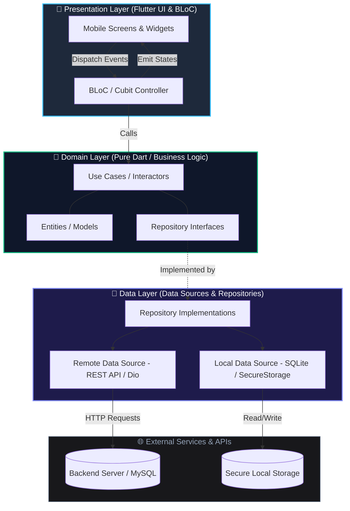

# 📱 Theeraphat Srimontha — Mobile Developer Portfolio

<div align="center">

  <!-- Badges -->
  <a href="https://theeraphat-portfolio.vercel.app/">
    
  </a>
  <a href="https://github.com/Theeraphat-S/Portfolio-Web">
    
  </a>
  <a href="mailto:theeraphat.sm@gmail.com">
    
  </a>

  <br />
  <br />

  <!-- Core Stacks -->
  
  
  
  
  
  

  <br />
  <br />

  <p align="center">
    <strong>🌟 High-Performance, Interactive & Bilingual Web Portfolio</strong><br />
    Showcasing production-ready Mobile Engineering in <b>Flutter, Dart, Clean Architecture, and BLoC</b>.
  </p>

  <p align="center">
    <a href="https://theeraphat-portfolio.vercel.app/"><strong>🌐 Launch Live Demo »</strong></a>
    &nbsp;•&nbsp;
    <a href="#-key-features">Features</a>
    &nbsp;•&nbsp;
    <a href="#-featured-projects">Projects</a>
    &nbsp;•&nbsp;
    <a href="#-technical-skills">Skills</a>
    &nbsp;•&nbsp;
    <a href="#-getting-started">Setup</a>
    &nbsp;•&nbsp;
    <a href="#-contact">Contact</a>
  </p>

</div>

---

> [!TIP]
> **Experience the Live Web App:** [**theeraphat-portfolio.vercel.app**](https://theeraphat-portfolio.vercel.app/)  
> Features real-time bilingual switching (TH/EN), 60 FPS Lenis smooth scrolling, an interactive phone simulator, and reactive micro-animations.

---

## ⚡ Overview & Key Highlights

This repository contains the source code for the personal web portfolio of **Theeraphat Srimontha (Oven)** — a **Mobile Application Developer** focused on building resilient, scalable cross-platform apps with **Flutter, Dart, BLoC, and Clean Architecture**.

### 🎯 Key Features

- 📱 **Interactive Mobile Simulator**: Dynamic smartphone mockup with screen-toggle interactions to test app previews live.
- 🌐 **Real-time Bilingual Engine**: Instant Thai/English localization powered by a single-source-of-truth state without hydration lag.
- ⚡ **60 FPS Lenis Smooth Scrolling**: Inertia-based momentum scrolling harmonized with the React 19 lifecycle.
- 🍱 **Glassmorphic Bento Grid**: Dark-mode spotlight cards organizing technical achievements, education, and credentials.
- 📬 **One-Click Contact & Confetti**: Clipboard API integration coupled with festive canvas confetti feedback.

---

## 🚀 Featured Projects

| Project                                                 | Stack & Highlights                                                                                                                                                                                                                                                       | Links                                                 |
| :------------------------------------------------------ | :----------------------------------------------------------------------------------------------------------------------------------------------------------------------------------------------------------------------------------------------------------------------- | :---------------------------------------------------- |
| **🏥 NCDs Screening App**<br>_(Senior Capstone)_        | • **Stack:** `Flutter`, `Dart`, `BLoC`, `Clean Architecture`, `REST API`, `MySQL`<br>• Risk assessment engine for 4 chronic diseases (Diabetes, Hypertension, Heart, Obesity)<br>• Multi-role UX (Doctor, Health Volunteer, Citizen) with 100% field validation accuracy | [Live Demo](https://theeraphat-portfolio.vercel.app/) |
| **📦 Pinto Logistics App**<br>_(Commercial Internship)_ | • **Stack:** `Flutter`, `Dart`, `Hybrid WebView Bridge`, `Agile/Scrum`<br>• Engineered bi-directional WebView bridge for seamless hybrid page transitions<br>• Implemented gamified daily chat streaks and rewards, boosting daily retention                             | [Live Demo](https://theeraphat-portfolio.vercel.app/) |
| **💳 POS & Store Management**<br>_(Enterprise System)_  | • **Stack:** `React`, `TypeScript`, `REST API`, `MySQL`, `State Management`<br>• 99.9% data consistency with optimistic UI updates and resilient offline retries<br>• Supports instant QR PromptPay and Cash transactions with receipt printing                          | [Live Demo](https://theeraphat-portfolio.vercel.app/) |

---

## 🛠️ Technical Skills

- **Mobile Development**: Flutter (Advanced), Dart, BLoC & Cubit, Clean Architecture, Provider, Android Studio, Native Builds (Android/iOS)
- **Web & Fullstack**: React 19, TypeScript, Vite, Tailwind CSS v4, Next.js, Java / Spring Boot, Go (Golang)
- **Databases & Tooling**: MySQL, Oracle DB, RESTful APIs, Postman, Git / GitHub Workflows, Antigravity IDE
- **Leadership & Teaching**:
  - **3x University Teaching Assistant (TA)** at Maejo University: _Client-Side Web Programming_, _Database Systems_, and _Logic & Programming Techniques_.
  - **Keynote Speaker**: Invited instructor on _"Smart AI for Education & Ethical Programming"_ for Gifted Computer students at Jakkhumkhanathorn School.

---

## 🏗️ Architecture & Codebase Details

<details>
<summary><b>📐 Click to expand: Mobile Clean Architecture Diagram & Principles</b></summary>

<br />

My mobile applications follow **Clean Architecture** decoupled with **BLoC** for strict unidirectional data flow and testability:



### Core Principles

1. **Separation of Concerns**: UI is completely independent from networking and storage.
2. **Predictable State Flow**: Single-direction state transitions guarantee deterministic UI.
3. **Resilient Networking**: Automatic token refreshes, interceptors, and offline fallbacks.

</details>

<details>
<summary><b>📂 Click to expand: Repository Directory Tree</b></summary>

<br />

```
portfolio-Web/
├── public/                 # Static assets & favicons
├── src/
│   ├── components/         # Modular React components
│   │   ├── reactbits/      # Micro-animations (Particles, DecryptedText, Magnet)
│   │   ├── AboutBento.tsx  # Bento grid layout
│   │   ├── MobileMockup.tsx# Interactive smartphone simulator
│   │   ├── Projects.tsx    # Project showcase cards & modal triggers
│   │   └── SmoothScroll.tsx# Lenis smooth scroll provider
│   ├── context/            # Language & theme state providers
│   ├── data/               # Single-source-of-truth portfolio datasets
│   ├── App.tsx             # Root layout & composition
│   ├── index.css           # Tailwind CSS v4 design tokens
│   └── main.tsx            # React 19 entry point
├── package.json
└── vite.config.ts
```

</details>

---

## 💻 Getting Started

### Prerequisites

- [Node.js](https://nodejs.org/) `>= 18.0.0`
- [npm](https://www.npmjs.com/) (or `pnpm` / `yarn`)

### Quick Start

```bash
# 1. Clone repository
git clone https://github.com/Theeraphat-S/Portfolio-Web.git
cd Portfolio-Web

# 2. Install dependencies
npm install

# 3. Launch local dev server
npm run dev
```

Build for production:

```bash
npm run build
npm run preview
```

---

## 👤 Contact & Developer Profile

<div align="center">

### **Theeraphat Srimontha (Oven)**

**Mobile Application Developer (Flutter & Dart Specialist)**  
_B.Sc. in Information Technology, Maejo University_

[](https://theeraphat-portfolio.vercel.app/)
[](https://github.com/Theeraphat-S)
[](mailto:theeraphat.sm@gmail.com)

📍 **Location:** Chiang Mai, Thailand (Open to **Onsite / Hybrid / Remote**)  
💼 **Status:** Open for Full-time Mobile Developer opportunities

</div>

---

## 📄 License

This project is licensed under the [MIT License](LICENSE).
