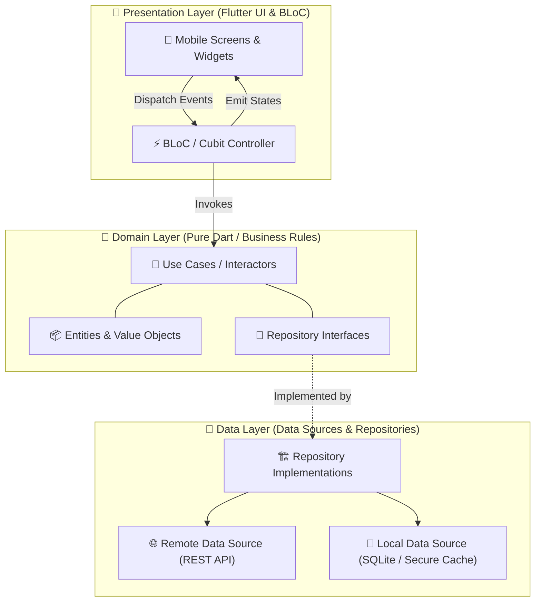

# 📱 Theeraphat Srimontha — Mobile Developer Portfolio

<div align="center">

  <!-- Status Badges -->
  <a href="https://theeraphat-portfolio.vercel.app/">
    
  </a>
  <a href="https://github.com/Theeraphat-S/Portfolio-Web">
    
  </a>
  <a href="mailto:theeraphat.sm@gmail.com">
    
  </a>
  <a href="tel:0647700893">
    
  </a>

  <br />
  <br />

  <!-- Core Tech Stacks -->
  
  
  
  
  
  
  

  <p align="center">
    <strong>🌟 High-Performance, Interactive & Bilingual Engineering Showcase</strong><br />
    Demonstrating production-grade cross-platform engineering with <b>Flutter, Dart, Clean Architecture, and BLoC</b>.
  </p>

  <p align="center">
    <a href="https://theeraphat-portfolio.vercel.app/"><strong>🌐 Open Live Portfolio App »</strong></a>
  </p>

</div>

---

## ⚡ Core Highlights

- 📱 **Interactive Mobile Simulator & Live DevTools**: In-browser smartphone shell simulating production mobile screens with a live developer drawer exposing BLoC event streams, widget trees, and FPS telemetry.
- 📜 **Scroll-Led Scrollytelling Runway**: Pinned viewport that synchronizes the simulated mobile app with architectural narrative beats as you scroll.
- 🌐 **Zero-Shift Bilingual Engine**: Instant Thai/English localization with fixed typography constraints guaranteeing zero layout shifts (CLS = 0).

---

## 📱 Mobile Architecture (Clean Architecture & BLoC)

All mobile systems follow strict Clean Architecture principles with unidirectional data flow:


```mermaid
flowchart TD
    subgraph UI_Layer["🎨 Presentation Layer (Flutter UI & BLoC)"]
        V["📱 Mobile Screens & Widgets"] -->|Dispatch Events| B["⚡ BLoC / Cubit Controller"]
        B -->|Emit States| V
    end

    subgraph Domain_Layer["🧠 Domain Layer (Pure Dart / Business Rules)"]
        UC["🎯 Use Cases / Interactors"] --- E["📦 Entities & Value Objects"]
        UC --- IR["🔌 Repository Interfaces"]
    end

    subgraph Data_Layer["💾 Data Layer (Data Sources & Repositories)"]
        R["🏗️ Repository Implementations"] --> RDS["🌐 Remote Data Source (REST API)"]
        R --> LDS["💽 Local Data Source (SQLite / Secure Cache)"]
    end

    B -->|Invokes| UC
    IR -.->|Implemented by| R
```

---

## 🚀 Featured Projects

### 🏥 NCDs Risk Screening App `Senior Capstone Project, 2025`

`Flutter` • `Dart` • `BLoC Pattern` • `Clean Architecture` • `REST API` • `MySQL`

- **Client-side Clinical Engine**: Migrated chronic disease risk algorithms on-device for village health volunteers (VHVs), eliminating human calculation error by 100%.
- **Measurable Impact**: Cut patient screening time from 10–15 min down to **< 3–5 min** with one-touch PDF clinical report generation.
- 🔗 [View Interactive Showcase](https://theeraphat-portfolio.vercel.app/)

### 📦 Pinto Logistics Commercial App `Internship at Fakduay, 2026`

`Flutter` • `Dart` • `WebSockets` • `Hybrid WebView Bridge` • `Agile/Scrum`

- **Real-Time GPS & Retention**: Low-latency courier tracking via WebSockets and gamified daily chat streaks with dynamic reward tier multipliers.
- **Hybrid Bridge Architecture**: Engineered a bidirectional `JavaScriptChannel` bridge synchronizing auth tokens and carts between legacy WebViews and native Flutter widgets.
- 🔗 [View Interactive Showcase](https://theeraphat-portfolio.vercel.app/)

### 💳 Enterprise Retail POS System `Commercial Retail`

`React 19` • `TypeScript` • `Tailwind CSS v4` • `REST API` • `ESC/POS`

- **Resilient Offline POS**: High-speed barcode scanning with sub-millisecond local SKU cache and SQLite Write-Ahead Logging (WAL) for 100% offline checkout continuity.
- **Hardware Integration**: Direct ESC/POS byte stream printing and instant dynamic PromptPay QR payment processing.
- 🔗 [View Interactive Showcase](https://theeraphat-portfolio.vercel.app/)

---

## 🛠️ Technical Skills

| Domain                     | Technologies & Expertise                                                                               |
| :------------------------- | :----------------------------------------------------------------------------------------------------- |
| **Mobile Development**     | **Flutter (Advanced)**, **Dart**, **BLoC & Cubit**, Provider, Clean Architecture, Android SDK          |
| **Frontend & Web**         | **React 19**, **TypeScript**, Next.js, Vite 6, Tailwind CSS v4, Motion, Lenis Smooth Scroll            |
| **Backend & Databases**    | **MySQL**, Oracle Database, Java / Spring Boot, Go (Golang), REST APIs, Postman                        |
| **Leadership & Mentoring** | **3x Teaching Assistant** (Client-side Web, Database Systems, Logic & Programming) at Maejo University |

---

## 💻 Quick Start

```bash
# Clone the repository
git clone https://github.com/Theeraphat-S/Portfolio-Web.git
cd Portfolio-Web

# Install dependencies & run development server
npm install
npm run dev
```

### Essential Scripts

| Command                | Action                                         |
| :--------------------- | :--------------------------------------------- |
| `npm run dev`          | Start local Vite development server            |
| `npm run build`        | Compile TypeScript and build production bundle |
| `npm run lint`         | Run ESLint 9 checks                            |
| `npm run format:check` | Verify Prettier code formatting                |

---

## 👤 Developer Profile & Contact

<div align="center">

### **Theeraphat Srimontha (Oven)**

**Mobile Application Developer (Flutter & Dart Specialist)**  
_B.Sc. in Information Technology, Maejo University (2022–2026)_  
📍 **Location:** Chiang Mai, Thailand (Open to **Onsite / Hybrid / Remote**) • 💼 **Status:** **Available immediately**

[](https://theeraphat-portfolio.vercel.app/)
[](https://github.com/Theeraphat-S)
[](mailto:theeraphat.sm@gmail.com)
[](tel:0647700893)

</div>

---

## 📄 License

This project is licensed under the [MIT License](LICENSE).
