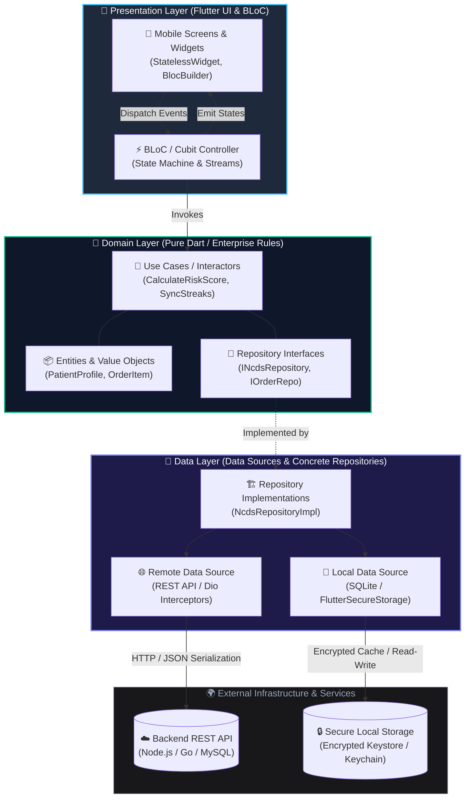

# 📱 Theeraphat Srimontha — Mobile Developer Portfolio

<div align="center">

  <!-- Status Badges -->
  <a href="https://theeraphat-portfolio.vercel.app/">
    
  </a>
  <a href="https://github.com/Theeraphat-S/Portfolio-Web">
    
  </a>
  <a href="mailto:theeraphat.sm@gmail.com">
    
  </a>
  <a href="tel:0647700893">
    
  </a>

  <br />
  <br />

  <!-- Core Stacks -->
  
  
  
  
  
  
  
  

  <br />
  <br />

  <p align="center">
    <strong>🌟 High-Performance, Interactive & Bilingual Web Portfolio</strong><br />
    Showcasing production-ready Mobile Engineering in <b>Flutter, Dart, Clean Architecture, and BLoC State Management</b>.
  </p>

  <p align="center">
    <a href="https://theeraphat-portfolio.vercel.app/"><strong>🌐 Launch Live Portfolio »</strong></a>
    &nbsp;•&nbsp;
    <a href="#-flagship-innovations--web-features">Web Features</a>
    &nbsp;•&nbsp;
    <a href="#-mobile-engineering--clean-architecture">Mobile Architecture</a>
    &nbsp;•&nbsp;
    <a href="#-featured-projects--case-studies">Projects</a>
    &nbsp;•&nbsp;
    <a href="#-technical-skills-matrix">Skills</a>
    &nbsp;•&nbsp;
    <a href="#-codebase-structure">Codebase</a>
    &nbsp;•&nbsp;
    <a href="#-getting-started">Setup</a>
    &nbsp;•&nbsp;
    <a href="#-contact--developer-profile">Contact</a>
  </p>

</div>

---

> [!TIP]
> **Experience the Live Web Application:** [**theeraphat-portfolio.vercel.app**](https://theeraphat-portfolio.vercel.app/)  
> Includes real-time bilingual switching (TH/EN), interactive smartphone playground with live DevTools, The Lens Stage architecture reveal, 60–120 FPS Lenis smooth scrolling, and reactive micro-interactions.

---

## ⚡ Flagship Innovations & Web Features

This portfolio is not just a static showcase — it is an engineered, interactive web application built with **React 19, TypeScript, Tailwind CSS v4, Motion, and Lenis**:

- 📱 **Interactive Mobile Simulator**: A dynamic smartphone viewport allowing visitors to interactively switch and test real mobile screens (**NCDs Healthcare Screening**, **Pinto Logistics Hybrid App**, and **Retail POS System**) with simulated native mobile gestures and status bar.
- 🛠️ **Live Mobile DevTools & Event Dock**: An integrated in-browser developer drawer exposing **BLoC State Streams**, **Widget Hierarchy Trees**, **Live FPS / Frame Telemetry**, and a real-time reactive event feed triggered as users interact with the mobile mockup.
- 🔍 **The Lens Stage (Interactive Spotlight Reveal)**: A physics-driven radial reveal mask (`clip-path: circle()`) that unmasks the architectural blueprint, Dart BLoC state machines, and engineering telemetry beneath the surface of project cards.
- 🌐 **Real-time Bilingual Engine**: Zero-lag Thai and English instant localization powered by a centralized React Context state with persistent user preference storage.
- 🌊 **60–120 FPS Fluid Inertia Scrolling**: Hardware-accelerated smooth scrolling using Lenis, seamlessly harmonized with the React 19 render cycle and Framer Motion spring physics.
- 🍱 **Glassmorphic Bento Grid & Telemetry Deck**: System pulse indicator, live Chiang Mai time clock (`Asia/Bangkok`), real-time job availability status, and interactive tech stack ribbons.
- 📬 **Tactile Contact & Confetti**: Clipboard API integration with instant feedback and multi-burst canvas confetti upon copying contact info.

---

## 📱 Mobile Engineering & Clean Architecture

Every mobile application featured in this portfolio is architected with **Clean Architecture** decoupled with the **BLoC (Business Logic Component)** pattern for deterministic state management, testability, and separation of concerns:


```mermaid
flowchart TD
    subgraph UI_Layer["🎨 Presentation Layer (Flutter UI & BLoC)"]
        direction TB
        V["📱 Mobile Screens & Widgets<br/>(StatelessWidget, BlocBuilder)"] -->|Dispatch Events| B["⚡ BLoC / Cubit Controller<br/>(State Machine & Streams)"]
        B -->|Emit States| V
    end

    subgraph Domain_Layer["🧠 Domain Layer (Pure Dart / Enterprise Rules)"]
        direction TB
        UC["🎯 Use Cases / Interactors<br/>(CalculateRiskScore, SyncStreaks)"]
        E["📦 Entities & Value Objects<br/>(PatientProfile, OrderItem)"]
        IR["🔌 Repository Interfaces<br/>(INcdsRepository, IOrderRepo)"]
        UC --- E
        UC --- IR
    end

    subgraph Data_Layer["💾 Data Layer (Data Sources & Concrete Repositories)"]
        direction TB
        R["🏗️ Repository Implementations<br/>(NcdsRepositoryImpl)"]
        RDS["🌐 Remote Data Source<br/>(REST API / Dio Interceptors)"]
        LDS["💽 Local Data Source<br/>(SQLite / FlutterSecureStorage)"]
        R --> RDS
        R --> LDS
    end

    subgraph External["🌍 External Infrastructure & Services"]
        direction LR
        API[("☁️ Backend REST API<br/>(Node.js / Go / MySQL)")]
        SEC[("🔒 Secure Local Storage<br/>(Encrypted Keystore / Keychain)")]
    end

    %% Flow Connections
    B -->|Invokes| UC
    IR -.->|Implemented by| R
    RDS -->|HTTP / JSON Serialization| API
    LDS -->|Encrypted Cache / Read-Write| SEC

    classDef ui fill:#1e293b,stroke:#38bdf8,stroke-width:2px,color:#f8fafc;
    classDef domain fill:#0f172a,stroke:#10b981,stroke-width:2px,color:#f8fafc;
    classDef data fill:#1e1b4b,stroke:#818cf8,stroke-width:2px,color:#f8fafc;
    classDef ext fill:#18181b,stroke:#64748b,stroke-width:1px,color:#94a3b8;

    class UI_Layer ui;
    class Domain_Layer domain;
    class Data_Layer data;
    class External ext;
```

### Core Architectural Principles

1. **Unidirectional Data Flow**: UI dispatches typed events to the BLoC; the BLoC executes Domain Use Cases and emits immutable states back to the UI.
2. **Offline-First & Resilient Logic**: Critical business calculations (such as health risk scoring algorithms) execute on the client-side domain layer without mandatory network connectivity.
3. **Repository Pattern Decoupling**: High-level business logic is decoupled from external APIs and database schemas, allowing seamless swapping of backend infrastructure.

---

## 🚀 Featured Projects & Case Studies

| Project                                                                                    | Highlights & Engineering Decisions                                                                                                                                                                                                                                                                                                                                                                                                                                                                              | Key Metrics                                                                                                                                                            | Links                                                     |
| :----------------------------------------------------------------------------------------- | :-------------------------------------------------------------------------------------------------------------------------------------------------------------------------------------------------------------------------------------------------------------------------------------------------------------------------------------------------------------------------------------------------------------------------------------------------------------------------------------------------------------- | :--------------------------------------------------------------------------------------------------------------------------------------------------------------------- | :-------------------------------------------------------- |
| **🏥 NCDs Risk Screening App**<br>_(Senior Capstone Project, 2025)_                        | • **Tech Stack:** `Flutter`, `Dart`, `BLoC`, `Clean Architecture`, `REST API`, `MySQL`<br>• Engineered clinical risk assessment algorithm for 4 major chronic diseases (Diabetes, Hypertension, Heart, Obesity).<br>• Migrated risk evaluation logic to client-side BLoC state machines, ensuring **100% offline-ready operations** for village health volunteers (VHVs) in remote areas.<br>• Field-tested with healthcare personnel to transform medical thresholds into intuitive color-coded range sliders. | • **< 3–5 min** screening time per patient (down from 10–15 min)<br>• **100% calculation accuracy** (zero human calculation error)<br>• **4 disease groups** supported | [Live Showcase](https://theeraphat-portfolio.vercel.app/) |
| **📦 Pinto Logistics Application**<br>_(Commercial Internship at Fakduay Logistics, 2026)_ | • **Tech Stack:** `Flutter`, `Dart`, `Hybrid WebView Bridge`, `Agile/Scrum`<br>• Engineered custom bi-directional **JavaScript-to-Flutter bridge** enabling seamless session, token, and state synchronization between native mobile shell and responsive web modules.<br>• Designed gamified daily chat streaks, check-in rewards, and visual milestone animations, significantly increasing user engagement.                                                                                                  | • **Seamless hybrid navigation** without frame drops<br>• **Boosted retention** via daily reward loop<br>• **Production deployment**                                   | [Live Showcase](https://theeraphat-portfolio.vercel.app/) |
| **💳 Enterprise POS & Store Management**<br>_(Commercial Retail System)_                   | • **Tech Stack:** `React`, `TypeScript`, `REST API`, `MySQL`, `Tailwind CSS`<br>• Built resilient checkout and inventory management pipeline with optimistic UI updates and automated retry queues for unstable network environments.<br>• Supports dual payment processing: instant dynamic **PromptPay QR** generation and cash transactions with receipt printing.                                                                                                                                           | • **99.9% transaction consistency**<br>• **Zero stock desync** during peak hours<br>• **Instant QR verification**                                                      | [Live Showcase](https://theeraphat-portfolio.vercel.app/) |

---

## 🛠️ Technical Skills Matrix

<div align="center">

| Domain                      | Core Technologies & Methodologies                                                                                                                                                                                                             |
| :-------------------------- | :-------------------------------------------------------------------------------------------------------------------------------------------------------------------------------------------------------------------------------------------- |
| **Mobile Engineering**      | **Flutter (Advanced)**, **Dart**, **BLoC & Cubit**, Provider, Clean Architecture, State Machines, Android Studio, Native Toolchains (Gradle / Android SDK)                                                                                    |
| **Frontend & Web**          | **React 19**, **TypeScript**, **Next.js**, **Vite 6**, **Tailwind CSS v4**, Framer Motion, Lenis Scroll, HTML5 / CSS3, Responsive Design                                                                                                      |
| **Backend & Databases**     | **MySQL**, **Oracle Database**, **Java / Spring Boot**, **Go (Golang)**, RESTful API Design, Postman API Testing                                                                                                                              |
| **DevOps & Workflows**      | Git & GitHub Workflows, ESLint & Prettier, CI/CD Fundamentals, Agile / Scrum Methodology                                                                                                                                                      |
| **Leadership & Mentorship** | **3x Teaching Assistant (TA)** at Maejo University (_Client-Side Web Programming_, _Database Systems_, _Logic & Programming Techniques_)<br>**Keynote Speaker**: _"Smart AI for Education & Ethical Programming"_ at Jakkhumkhanathorn School |

</div>

---

## 📂 Codebase Structure

The portfolio codebase follows an organized, component-driven modular structure:

```
portfolio-Web/
├── public/                     # Static assets, icons, and favicons
├── src/
│   ├── components/             # Reusable UI component modules
│   │   ├── icons/              # Custom Iconsax linear & bulk icon set
│   │   ├── mobile-mockup/      # Interactive Smartphone Playground & DevTools
│   │   │   ├── BlueprintScreen.tsx   # Architectural blueprint overlay
│   │   │   ├── DevToolsDrawer.tsx    # Live BLoC state stream & telemetry inspector
│   │   │   ├── LiveEventDock.tsx     # Reactive event monitor dock
│   │   │   ├── NcdsScreen.tsx        # Simulated NCDs screening interface
│   │   │   ├── PintoScreen.tsx       # Simulated Pinto logistics & chat streak
│   │   │   └── PosScreen.tsx         # Simulated POS retail checkout
│   │   ├── reactbits/          # High-performance micro-interaction components
│   │   │   ├── DecryptedText.tsx     # Cybernetic text decode animation
│   │   │   ├── Magnet.tsx            # Magnetic physics cursor attraction
│   │   │   ├── Particles.tsx         # Ambient floating canvas particle mesh
│   │   │   └── ShinyText.tsx         # Metallic specular text shimmer
│   │   ├── sections/           # Modular landing page sections
│   │   │   ├── hero/                 # Editorial hero display, badges, & CTA
│   │   │   ├── about/                # Glassmorphic bento grid & live telemetry
│   │   │   ├── experience/           # Career timeline & academic credentials
│   │   │   ├── skills/               # Interactive skill bars & category matrix
│   │   │   ├── projects/             # Project cards with The Lens Stage reveal
│   │   │   ├── contact/              # Direct contact reach-out & confetti trigger
│   │   │   ├── MarqueeRibbons.tsx    # Kinetic tech stack ticker
│   │   │   └── TelemetryDeck.tsx     # System status, pulse & Chiang Mai clock
│   │   ├── Navbar.tsx          # Floating glassmorphic navigation with language toggle
│   │   ├── Footer.tsx          # Minimalist footer with quick navigation links
│   │   ├── Preloader.tsx       # Animated signature entrance transition
│   │   ├── ScrollProgressBar.tsx # Top reading progress indicator
│   │   └── SmoothScroll.tsx    # Lenis 60–120 FPS momentum scrolling provider
│   ├── context/                # Language (TH/EN) state management
│   ├── data/                   # Centralized single-source-of-truth portfolio datasets
│   │   ├── dartCodeSnippets.ts # Code viewer samples for live DevTools
│   │   ├── experiences.ts      # Work experience and education history
│   │   ├── personal.ts         # Contact info, bio, and references
│   │   ├── projects.ts         # In-depth project case studies & metrics
│   │   └── skills.ts           # Technical skill competencies & levels
│   ├── hooks/                  # Custom React hooks (active section, media queries)
│   ├── lib/                    # Utility helpers (clsx, tailwind-merge)
│   ├── types/                  # TypeScript interface definitions
│   ├── App.tsx                 # Root layout composition & modal manager
│   ├── index.css               # Tailwind CSS v4 design tokens & keyframe animations
│   └── main.tsx                # React 19 application mount point
├── package.json                # Project dependencies and script definitions
├── tsconfig.json               # TypeScript compiler configuration
└── vite.config.ts              # Vite 6 build & plugin configuration
```

---

## 💻 Getting Started

### Prerequisites

- [Node.js](https://nodejs.org/) `>= 18.0.0`
- [npm](https://www.npmjs.com/) (or `pnpm` / `yarn`)

### Quick Start

```bash
# 1. Clone the repository
git clone https://github.com/Theeraphat-S/Portfolio-Web.git
cd Portfolio-Web

# 2. Install dependencies
npm install

# 3. Launch local development server (Vite 6)
npm run dev
```

Visit `http://localhost:5173` in your browser.

### Available Scripts

| Command                | Description                                                          |
| :--------------------- | :------------------------------------------------------------------- |
| `npm run dev`          | Starts Vite dev server with hot module replacement (HMR)             |
| `npm run build`        | Compiles TypeScript and builds production distribution in `dist/`    |
| `npm run preview`      | Locally previews the production build bundle                         |
| `npm run lint`         | Runs ESLint 9 to analyze code quality and potential issues           |
| `npm run lint:fix`     | Runs ESLint and automatically resolves fixable lint warnings         |
| `npm run format`       | Runs Prettier to enforce consistent code formatting across all files |
| `npm run format:check` | Checks code formatting against Prettier rules                        |

---

## 👤 Contact & Developer Profile

<div align="center">

### **Theeraphat Srimontha (Oven)**

**Mobile Application Developer (Flutter & Dart Specialist)**  
_B.Sc. in Information Technology, Faculty of Science, Maejo University (2022 – 2026)_

[](https://theeraphat-portfolio.vercel.app/)
[](https://github.com/Theeraphat-S)
[](mailto:theeraphat.sm@gmail.com)
[](tel:0647700893)

<br />

📍 **Location:** Chiang Mai, Thailand (Open to **Onsite / Hybrid / Remote**)  
💼 **Status:** **Available immediately** for Full-time Mobile Developer positions

</div>

---

## 📄 License

This project is licensed under the [MIT License](LICENSE).
